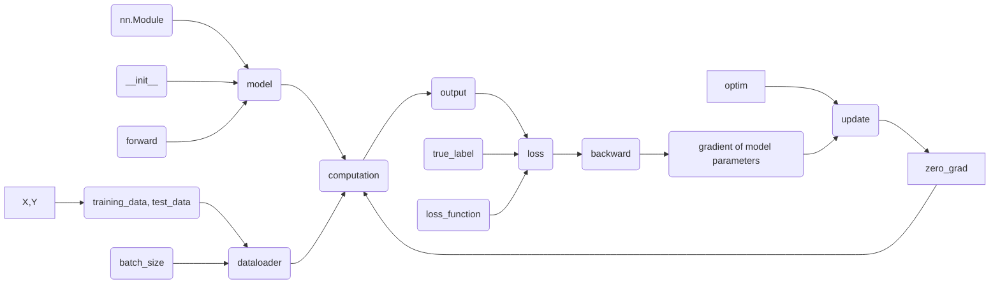

# PyTorch Notes

> @author:  Yuanhang Tang (汤远航)
>
> @e-mail: yuanhangtangle@gmail.com

## [Tutorial/quickstart](https://pytorch.org/tutorials/beginner/basics/quickstart_tutorial.html)

### Commonly used modules

- torch
- torch.nn
  - nn.Parameter
  - nn.Sequential
- torch.nn.functional
- torch.nn.Module
- torch.utils.data.Dataloader
- torch.optim