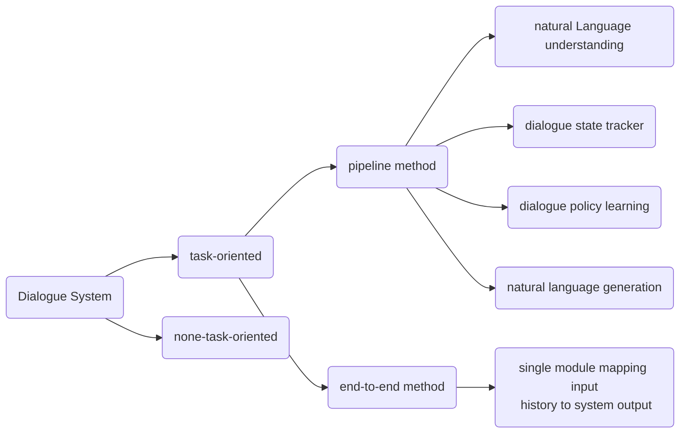

# Paper Notes

> @author:  汤远航 (Yuanhang Tang)
>
> @e-mail: yuanhangtangle@gmail.com

## A Survey on Dialogue Systems:Recent Advances and New Frontiers

> @datetime: 2021/04/03
>
> [weblink](https://arxiv.org/abs/1711.01731) or [click for local file](./A_Survey_on_Dialogue_Systems_Recent_Advances_and_New_Frontiers.pdf)

This paper gives an overview to dialogue systems. More specifically, this paper categorizes DS into two main kinds: task-oriented system and non-task-oriented system. See the graph below for more details:

### Task-Oriented System

Assist the user to complete some task

- **NLU** (**Natural language understanding**): 
	extract information from  user utterance.
  - Maps the user utterance into **predefined slots**. A slot is a concept ID, e.g. location, date time, etc. **Slot filling** assigns each input word with a predefined semantic label. It takes a sentence as input and output a sequence of slots. one for each word in the input sentence. This can be modeled as a **sequence labeling problem** similar to the POS tagging problem.
  - Classifies the user intent into **predefined intent** or detect dialogue **domain**. This is simply a classification problem. Statistical method or deep learning method can be applied to address this issue.
  - The semantic representation generated in this step is passed to the next step.

- **Dialogue state tracking**: 
	The user's goal may change during the conversation, and this can be modeled as a **state struture** similar to the one adopted in NAOGOLF. According to semantic representation generated in the last step, a state management system (**rule-based system**, **statistic dialog system** or **deep learning based dialog model**) mantains a state struture and categorizes the current situation into one of the predefined states (commonly called **semantic frame** or **slot**) by combining the previous system acts, dialogue history and previous dialogue states. This is the core component to ensure a robust manner.
	- **rule-based system**: Like what we do in NAOGOLF;
	- **statistical method**: Mantains a distribution over predefined slots, and output the most likely one;
	- **deep learning based methodd**: Just train it;

- **Policy learning**:
	Conidtioned on the state representation, policy learning component generates the next system action. **Rule-based method**, **supervised learning method** or **reinforcement learning method** can be adopted to choose one of **predefined action** based on current state. This module may interates with a external database to generate meaningful action.

- **NLG** (**natural language generation**):
	Conditioned on the chosen action, state and other representation from the upstream modules, NLG module converts this semantic symbols into natura language and present the result to the user. 
	- Conventional method typically adopt a **sentence planning system** which first convert the semantic symbols to intermediary form such as template or tree-like structures and then convert them into final response.
	- Deep learning based model: Just train it.

- **End-to-End Method**:
	End-to-end model uses a single module to map the dialogue history to the final response.

- **Shortcomings**:
	A task-oriented dialogue system aims at asssiting the use to complete some task, thus it is usually related to some certain domain, e.g. shopping, custom service, etc. A conventional rule-based dialogue system is usually specialized with **interdependent components**, and **does not promise portability**. **Significant human effort**, including **data collection**, labeling, rule design, template design and so on, must be devoted to create such a system. Moreover, it is **hard to design update method** for such systems since operations like **querying external database** are **non-differentiable**, and the user's feedback is hard to be **propagated to upstream modules**.

- **Techniques**: 
	- **rule design**: 
		- Like what we do in NAOGOLF
	- **statistical methods**:
		- Output the probability of each slot for each input word
		- Output the probability for each predefined intent or domain
	- **supervised learning methods**:
		- End-to-End model: replace non-differentiable operations with differentiable layers
		- Classification model
	- **reinforcement learning methods**:
		- Model the dialogue system as an intelligent agent interacting with the user
	- **Generalization and Specialization**:
		- Generalization for portability, specialization for good performance
		- *Pre-train and fine-tune*

### Non-Task-Oriented System
Take with the user on open domains; Chatting robot such as Xiaoai, Siri, etc

- **Neural Generative Models**: sequence-to-sequence models
	- capture dialogue context
	- increase response diversity, reduce meaningless responses:
		- modify decoder
		- design better objective function
		- introduce **latent variables** to mantain a distribution
		- model dialogue topic and the user's personality
		- query knowledge database
	- learning throught interaction

- **Retrival-based Methods**:
	- choose a response from predefined responses
	- a repsonse match problem: single turn or multi-turn

- **evaluation**: hard to automatically evaluate; some criteria
	- forward-looking
	- informative
	- coherent
	- interactint

## An introduction to ROC analysis
>@datetime: 2021/04/17
>
> [weblink](https://www.researchgate.net/publication/222511520_Introduction_to_ROC_analysis/link/5ac7844ca6fdcc8bfc7fa47e/download) or [click for local file](./ROCintro.pdf)
> 
> 我决定还是写中文, 高效方便. 这篇文章只简单看了ROC曲线和AUC的含义. 

- **基本指标**: 
  
  ROC曲线纵轴为`TPR`, 横轴为`FPR`. 这两个指标都以预测正样本为研究对象, 这种思维其实默认了正样本具有更高的重要性. 具体的: 

$$
TPR = \frac{TP}{P} = \frac{TP}{TP + FN}\\

FPR = \frac{FP}{N} = \frac{FP}{FP + TN}
$$

- **直观认识**: 
  
  `TPR` 衡量准确的正样本预测, 描述模型是否能够正确的预测正样本; `FPR`衡量错误的正样本预测, 描述模型是否会错误的将负样本预测为正样本. 两个指标综合描述了模型对正样本的预测的合理程度. 理想地, `TPR`应该尽可能高, `FPR`应该尽可能低. 模型越倾向于预测正样本, 则`TPR`越可能大, 但是`FPR`也会随之变大, 故而ROC曲线右上角的点较为"激进", 而左下角的点较为"保守"

- **基准**: 
  
  在ROC曲线图上, 位于`y = x`左上角的点满足`TPR > FPR`, 位于右下角上的点通过反转预测标记可以映射到左上角. 位于对角线上的点可以理解为随机猜测, 正负样本的预测正样本都是是对错参半. 从这个理解可以看出, ROC曲线的基准为对角线, 也就是, **任何一个样本都以1/2的概率预测为正样本**. 

- **绘制方法**: 
  
  对于输出置信度的模型, ROC曲线的绘制通过改变阈值进行. 具体的, 根据样本置信度从高到低排列. 开始将阈值设定为最高使得所有样本都被预测为负样本, 每次往后新增一个正样本, 并在ROC图上, 绘制直到所有样本都被预测为正样本. 这样得到的ROC曲线可以理解为对模型实际ROC曲线的近似. 

- **AUC**: 
  
  绘制的ROC曲线下方的面积. 如果有样本置信度从高到低(各不相同)的序列 $x_1, x_2, ..., x_m$, 对应的真实标记序列 $y_1, y_2, ..., y_m$, 正样本数量 $P$, 负样本数量 $N$ 可以推导出:
	$$
		AUC = \frac{\sum_{i<j} (\mathbb{1}\{ y_i > y_j \} + 0.5 * \mathbb{1}\{ y_i = y_j \}) }{PN}	
	$$
	这其实就是: 从序列中任取一个正样本和一个负样本, 模型会给予正样本更高置信度的概率. 这个概率其实就是对**模型认为正样本比负样本更像正样本的概率**的估计.

- **进一步讨论**: 
  
  `TPR`和`FPR`其实都是以真实标记的统计为分母, 故这两个指标其实都是反映了预测正样本符合真实标记的程度. 而精准率`PREC`定义为:
  $$
  PREC = \frac{TP}{TP + FP}
  $$
  即正确的预测正样本占预测正样本的概率. 这个指标则是反映预测正样本用于进一步分析处理的可靠度. 将`PREC`和`TPR(REC)`结合起来则可以绘制`PRC`, 得到另一个图. ROC曲线的基准是1/2随机分配, 对于不均衡样本而言, 这个基准显然并不合理, 因为我们显然可以以更高的概率预测占比较高的标记. `PRC`曲线则针对此进行了的修正. 

- **分布意义下的ROC以及AUC**: 
  
  假定一个模型输出给定样本是正样本的概率, 那么这个概率本身具有一定的分布. 单个负样本对应的模型输出概率形成**负样本模型概率分布**, 单个正样本对应概率分布形成**正样本模型概率分布**. 在给定一个阈值的情况下, 我们将模型输出概率高于这个阈值的样本分为正样本, 低于这个阈值的样本分为负样本, 这种分类方法的一个假设是, 正样本模型概率应该普遍比负样本模型概率大; 直观的, 正样本模型概率的概率密度分布图应该比负样本模型概率的概率密度图更靠近 $x$ 轴的右侧, 而且重叠部分尽可能的小. 理论上的ROC曲线是通过这个分布计算出来的. 具体的, 假设正样本模型概率的概率密度函数为$f_{+}(p)$, 负样本模型概率的概率密度函数为$f_{-}(p)$, 联合密度分布为$f(p_+, p_-)$, 给定阈值$T$, 有
  $$
  TPR = \int_{t > T} f_{+}(t) dt\\
  FPR = \int_{t > T} f_{-}(t) dt\\
  $$
  自然的, $T$ 越小, 两个数值都越大, ROC曲线从左到右反映了$T$变化的过程. 而$AUC$则定义为:
  $$
  AUC = \int_{p_+ > p_-} f(p_+, p_-) dp
  $$
  即正样本相比于负样本具有更高的模型输出概率的概率.

- **分布决定了ROC**: 
  
  从上述讨论可以看出, ROC曲线是完全由单个样本的模型概率分布决定的, 而单个样本的模型概率分布则是总体的分布以及模型自身的特点决定的. 在实际的计算中, 假设正样本总体的分布, 以及负样本总体的分布保持不变, 模型不变, 在基数较大的情况下, 测试集中正负样本的采样比例不会对ROC和AUC产生太大的影响. 然而, 在样本极不均衡的情况下(往往是我们不太关心的负样本有相当高的占比), 我们往往会希望对`FPR`进行更严格的控制以减少`FP`总量的绝对数值(尽管相对比例保持不变). 因为实际应用中, 我们往往是对预测正样本(`TP+FP`)进行处理, 这时占比太高的`FP`将造成较大的资源损耗. 这时, ROC 和 AUROC 无法对模型的性能给出较好的刻画. 这就是下一篇[文章](#the-precision-recall-plot-is-more-informative-than-the-roc-plot-when-evaluating-binary-classifiers-on-imbalanced-datasets)给的分析

- **ROC不反映类别不均衡的直观理解**: 
  
  考虑实际的计算过程. 给定一个阈值, 假设负样本的总数按一定的比例升高, 在分布不变的情况下, 置信度序列各处的负样本总数也将大致按比升高, 改变阈值过程中, 负样本出现的次数大致按比升高, 但是由于基数也按比增大, 增加的`FPR`没有太大变化. 最显著的变化是, 曲线变得相对光滑了一些. 这个结果可以从下一篇[文章](#the-precision-recall-plot-is-more-informative-than-the-roc-plot-when-evaluating-binary-classifiers-on-imbalanced-datasets)给的实验中看出. 

----------------------------------------

## The Precision-Recall Plot Is More Informative than the ROC Plot When Evaluating Binary Classifiers on Imbalanced Datasets
> @datetime: 2021/4/19
> 
> [weblink](https://www.researchgate.net/publication/273155496_The_Precision-Recall_Plot_Is_More_Informative_than_the_ROC_Plot_When_Evaluating_Binary_Classifiers_on_Imbalanced_Datasets) or  [click for local file](./PRC_imbalanced_dataset.pdf)

- **一些指标的理解**:
  
  - `TPR, REC`: 正样本中, 预测正确的数量. 随着阈值的减小而升高.
  - `PREC`: 预测正样本中, 预测正确的数量. 
  - `ACC`: 所有样本中, 预测正确的数量
  - `FPR`: 负样本中, 预测`错误`的数量. 随着阈值的减小而升高.

- **评估模型的准则**:

	在考虑评估指标的时候, 我们需要考虑这些指标为什么有效, 即一个模型好坏的根本评判标准是什么. 在不同的场合, 这个评判的标准是不同的. 假设我们研究的问题有这样的特性:

	1. 正样本是我们关心的样本, 负样本则是不太关心的样本. 此时, 负样本可以理解为 "不是正样本的那些样本";
	2. 选择了一定的阈值后, 我们将会处理所有的预测正样本;
	3. 我们希望使用尽可能少的资源处理尽可能多的正样本.

	`2`和`3`表现出了一定的矛盾性. 我们想处理正样本, 但实际上我们只能处理预测正样本. 为了实现`3`所言"尽可能少的资源", 我们希望资源尽可能的少浪费在`FP`上, 因而希望`PREC`更高; 为了实现`3`所言"尽可能多的正样本", 我们希望`TPR = REC`更高. 这就使我们关心`PREC-RECALL`之间的矛盾和平衡.

- discussion
  
  - 翻转正负样本对AUC没有影响, 会对称的映射ROC, 又会如何影响PRC?
  - ROC在均衡情况下为什么有优势? 好算, 和PRC相关.