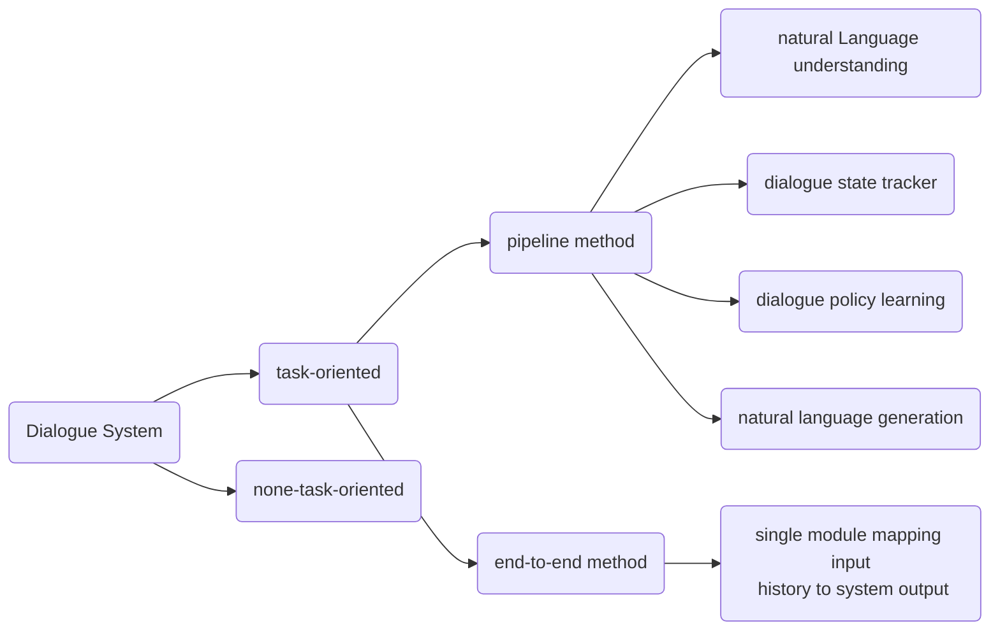

# Paper Notes

> @author:  汤远航 (Yuanhang Tang)
>
> @e-mail: yuanhangtangle@gmail.com

## A Survey on Dialogue Systems:Recent Advances and New Frontiers

> @datetime: 2021/04/03
>
> @link: https://arxiv.org/abs/1711.01731

This paper gives an overview to dialogue systems. More specifically, this paper categorizes DS into two main kinds: task-oriented system and non-task-oriented system. See the graph below for more details:

### Task-Oriented System

Assist the user to complete some task

- **NLU** (**Natural language understanding**): 
	extract information from  user utterance.
  - Maps the user utterance into **predefined slots**. A slot is a concept ID, e.g. location, date time, etc. **Slot filling** assigns each input word with a predefined semantic label. It takes a sentence as input and output a sequence of slots. one for each word in the input sentence. This can be modeled as a **sequence labeling problem** similar to the POS tagging problem.
  - Classifies the user intent into **predefined intent** or detect dialogue **domain**. This is simply a classification problem. Statistical method or deep learning method can be applied to address this issue.
  - The semantic representation generated in this step is passed to the next step.

- **Dialogue state tracking**: 
	The user's goal may change during the conversation, and this can be modeled as a **state struture** similar to the one adopted in NAOGOLF. According to semantic representation generated in the last step, a state management system (**rule-based system**, **statistic dialog system** or **deep learning based dialog model**) mantains a state struture and categorizes the current situation into one of the predefined states (commonly called **semantic frame** or **slot**) by combining the previous system acts, dialogue history and previous dialogue states. This is the core component to ensure a robust manner.
	- **rule-based system**: Like what we do in NAOGOLF;
	- **statistical method**: Mantains a distribution over predefined slots, and output the most likely one;
	- **deep learning based methodd**: Just train it;

- **Policy learning**:
	Conidtioned on the state representation, policy learning component generates the next system action. **Rule-based method**, **supervised learning method** or **reinforcement learning method** can be adopted to choose one of **predefined action** based on current state. This module may interates with a external database to generate meaningful action.

- **NLG** (**natural language generation**):
	Conditioned on the chosen action, state and other representation from the upstream modules, NLG module converts this semantic symbols into natura language and present the result to the user. 
	- Conventional method typically adopt a **sentence planning system** which first convert the semantic symbols to intermediary form such as template or tree-like structures and then convert them into final response.
	- Deep learning based model: Just train it.

- **End-to-End Method**:
	End-to-end model uses a single module to map the dialogue history to the final response.

- **Shortcomings**:
	A task-oriented dialogue system aims at asssiting the use to complete some task, thus it is usually related to some certain domain, e.g. shopping, custom service, etc. A conventional rule-based dialogue system is usually specialized with **interdependent components**, and **does not promise portability**. **Significant human effort**, including **data collection**, labeling, rule design, template design and so on, must be devoted to create such a system. Moreover, it is **hard to design update method** for such systems since operations like **querying external database** are **non-differentiable**, and the user's feedback is hard to be **propagated to upstream modules**.

- **Techniques**: 
	- **rule design**: 
		- Like what we do in NAOGOLF
	- **statistical methods**:
		- Output the probability of each slot for each input word
		- Output the probability for each predefined intent or domain
	- **supervised learning methods**:
		- End-to-End model: replace non-differentiable operations with differentiable layers
		- Classification model
	- **reinforcement learning methods**:
		- Model the dialogue system as an intelligent agent interacting with the user
	- **Generalization and Specialization**:
		- Generalization for portability, specialization for good performance
		- *Pre-train and fine-tune*

### Non-Task-Oriented System
Take with the user on open domains; Chatting robot such as Xiaoai, Siri, etc

- **Neural Generative Models**: sequence-to-sequence models
	- capture dialogue context
	- increase response diversity, reduce meaningless responses:
		- modify decoder
		- design better objective function
		- introduce **latent variables** to mantain a distribution
		- model dialogue topic and the user's personality
		- query knowledge database
	- learning throught interaction

- **Retrival-based Methods**:
	- choose a response from predefined responses
	- a repsonse match problem: single turn or multi-turn

- **evaluation**: hard to automatically evaluate; some criteria
	- forward-looking
	- informative
	- coherent
	- interactint

## An introduction to ROC analysis
>@datetime: 2021/04/17
>
> @link: https://www.researchgate.net/publication/222511520_Introduction_to_ROC_analysis/link/5ac7844ca6fdcc8bfc7fa47e/download
>
> 我决定还是写中文, 高效方便. 

这篇文章只简单看了ROC曲线和AUC的含义. 

ROC曲线纵轴为`TPR`, 横轴为`FPR`. 这两个指标都以预测正样本为研究对象, 这种思维其实默认了正样本具有更高的重要性. 具体的: 

$$
TPR = \frac{TP}{P} = \frac{TP}{TP + FN}\\

FPR = \frac{FP}{N} = \frac{FP}{FP + TN}
$$

- `TPR` 衡量准确的正样本预测, 描述模型是否能够正确的预测正样本; `FPR`衡量错误的正样本预测, 描述模型是否会错误的将负样本预测为正样本. 两个指标综合描述了模型对正样本的预测的合理程度. 理想地, `TPR`应该尽可能高, `FPR`应该尽可能低. 

- 在ROC曲线图上, 位于`y = x`左上角的点满足`TPR > FPR`, 位于右下角上的点通过反转预测标记可以映射到左上角. 位于对角线上的点可以理解为随机猜测, 正负样本的预测正样本都是是对错参半.

- 模型越倾向于预测正样本, 则`TPR`越可能大, 但是`FPR`也会随之变大, 故而ROC曲线右上角的点较为"激进", 而左下角的点较为"保守"

- 对于输出置信度的模型, ROC曲线的绘制通过改变阈值进行. 具体的, 根据样本置信度从高到低排列. 开始将阈值设定为最高使得所有样本都被预测为负样本, 每次往后新增一个正样本, 并在ROC图上, 绘制直到所有样本都被预测为正样本.

- 这样得到的ROC曲线可以理解为对模型实际ROC曲线的近似. AUC则是绘制的ROC曲线下方的面积. 如果有样本置信度从高到低的序列 $x_1, x_2, ..., x_m$, 对应的真实标记序列 $y_1, y_2, ..., y_m$, 正样本数量 $P$, 负样本数量 $N$ 可以推导出:
$$
	AUC = \frac{\sum_{i<j} \mathbb{1}\{ y_i = 1 \wedge y_j = -1 \}}{PN}
$$
这其实就是: 从序列中任取一个正样本和一个负样本, 模型会基于负样本更高置信度的概率. 这个概率其实就是对**模型认为正样本比负样本更像正样本的概率**的估计.